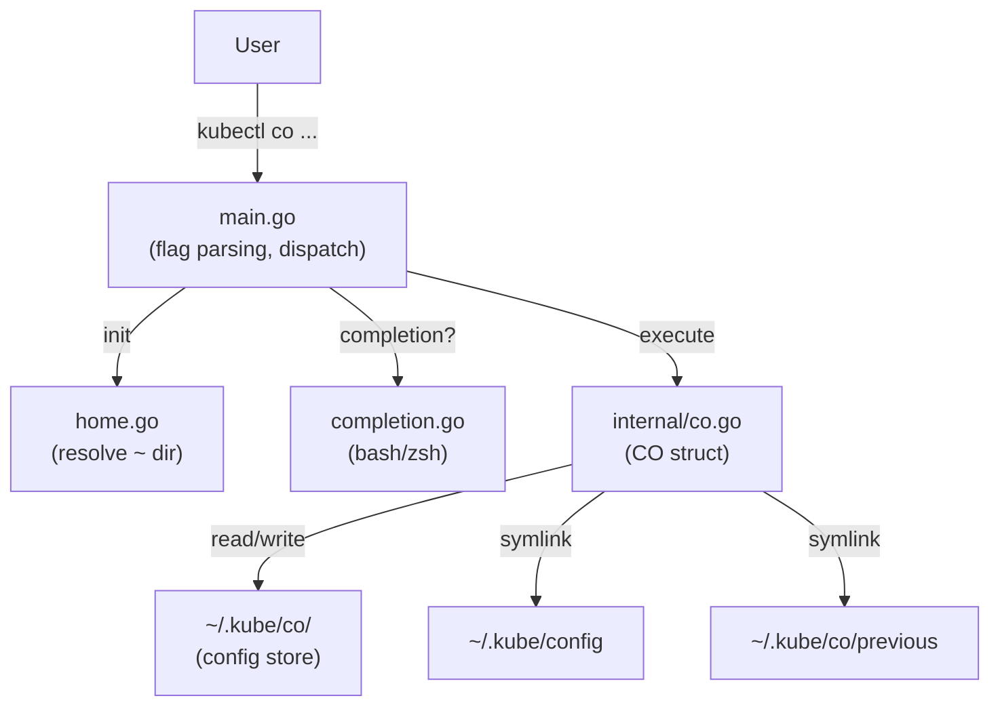

# Design — kubectl-co

## 1. Architecture Overview

kubectl-co is a single-binary CLI tool that acts as a kubectl plugin.
It manages kubeconfig files by storing them in `~/.kube/co/` and symlinking
the active config to `~/.kube/config`.



### Data flow — switching configs

1. User runs `kubectl co <name>`.
2. `main.go` parses flags via pflag, resolves home directory, creates `CO` instance.
3. `CO.LinkKubeConfig()` removes the existing `~/.kube/config` and `~/.kube/co/previous` symlinks.
4. Creates `~/.kube/config -> ~/.kube/co/<name>`.
5. Creates `~/.kube/co/previous -> <old target>` for rollback.

---

## 2. Project Structure

```
kubectl-co/
├── main.go              # Entry point: flags, viper config, dispatch
├── completion.go        # Shell completion (bash, zsh)
├── home.go              # Home directory resolution
├── go.mod / go.sum
├── internal/
│   ├── co.go            # Core logic: CO struct and methods
│   └── co_test.go       # Unit tests (testify, table-driven)
├── test/
│   └── test.yml         # Fixture file for tests
├── .github/workflows/
│   ├── go-test.yml      # CI: go test on push/PR
│   ├── release.yml      # CD: semantic-release + goreleaser
│   └── codeql-analysis.yml
├── .goreleaser.yaml     # Build & homebrew tap config
├── .golangci-lint.yaml  # Linter config
├── renovate.json        # Dependency management
├── spec/                # Specification files (this directory)
└── README.adoc
```

---

## 3. API Design

Not applicable — kubectl-co is a CLI tool with no HTTP API.

### CLI Interface

| Command / Flags | Description |
|---|---|
| `kubectl co` | List all configs |
| `kubectl co <name>` | Switch to named config |
| `kubectl co --add <name> [path]` | Add config (copy or create empty) |
| `kubectl co --delete <name>` | Delete named config |
| `kubectl co --previous` | Switch to previous config |
| `kubectl co --current` | Show current config path |
| `kubectl co --debug` | Enable debug logging |
| `kubectl co --version` | Print version |
| `kubectl-co completion bash\|zsh` | Output shell completion script |

---

## 4. Data Model

### CO struct (`internal/co.go`)

| Field | Type | Description |
|---|---|---|
| `ConfigName` | `string` | Name of the target config (positional arg) |
| `CObasePath` | `string` | Path to `~/.kube/co/` |
| `KubeConfigPath` | `string` | Path to `~/.kube/config` |
| `PreviousConifgPath` | `string` | Resolved target of `~/.kube/co/previous` |
| `PreviousConfigLink` | `string` | Path to the previous symlink itself |
| `CurrentConfigPath` | `string` | Resolved target of `~/.kube/config` |
| `Configs` | `[]string` | Populated by `ListConfigs()` |

### cmdCfg struct (`main.go`)

| Field | Type | Viper key |
|---|---|---|
| `Delete` | `bool` | `delete` |
| `Debug` | `bool` | `debug` |
| `Add` | `bool` | `add` |
| `Previous` | `bool` | `previous` |
| `Current` | `bool` | `current` |

---

## 5. Storage

Plain filesystem — no database.

| Path | Purpose |
|---|---|
| `~/.kube/co/` | Directory holding all managed config files |
| `~/.kube/co/previous` | Symlink pointing to the last-active config |
| `~/.kube/config` | Symlink pointing to the currently-active config |
| `~/.config/kubectl-co/config.yaml` | Optional viper config file for persistent flags |

All files and symlinks are created with `0700` permissions (owner-only).

---

## 6. Configuration Management

| Source | Mechanism |
|---|---|
| CLI flags | `spf13/pflag` (parsed in `init()`) |
| Environment variables | `spf13/viper` with prefix `KUBECTL_CO_` |
| Config file | `~/.config/kubectl-co/config.yaml` (optional, via viper) |

Priority (highest to lowest): flags → env vars → config file → defaults.

---

## 7. Error Handling Strategy

- All internal functions return `error`; callers in `main.go` use `eslog.LogIfErrorf(..., eslog.Fatalf, ...)` to log and exit on fatal errors.
- Filesystem errors are wrapped with `fmt.Errorf("context: %w", err)` for traceability.
- `fs.ErrNotExist` is handled gracefully where absence is acceptable (e.g. cleanup of non-existent symlinks).

---

## 8. Security Considerations

- **File permissions:** All managed files and symlinks use `0700` to prevent credential leakage.
- **No secrets in code:** No credentials are stored in source; kubeconfig content is user-managed.
- **Input validation:** Flag combinations are validated before execution (`validateFlags`).
- **KUBECONFIG precedence:** The README warns that the `KUBECONFIG` env var overrides the symlink, which is standard kubectl behaviour.
